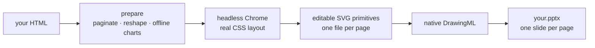

<h1 align="center">html-to-pptx</h1>

<p align="center">
  Turn an HTML deck into a PowerPoint file you can <strong>actually edit</strong>.<br>
  Every word, table cell and chart bar is a native PowerPoint shape — not a screenshot.
</p>

<p align="center"><a href="./README.md">简体中文</a> · <strong>English</strong></p>

<p align="center">
  <a href="https://github.com/yuna78/html-to-pptx/actions/workflows/ci.yml"></a>
  <a href="./LICENSE"></a>
  
  
  
</p>

<p align="center"></p>

```bash
bin/html-to-pptx report.html      # report.pptx lands right next to report.html
```

---

> **It is a general-purpose command-line tool first**, an agent skill second.
> Run it in a terminal, put it in a Makefile, wire it into CI, call it from any script — no
> Claude, no account, no network required. It is also a **portable agent skill**: `SKILL.md`
> in the repo root is a standard skill description, so Claude Code / Claude Desktop pick it up
> when cloned into the skills directory, and Cursor, Codex or any agent that can shell out can
> register the executable in `bin/` as a tool.

## Why this exists

The usual way to get a deck out of HTML is to screenshot each page onto a slide. It
*looks* like PowerPoint and cannot be edited. When someone asks you to change one number
in a title, you go back to the HTML and export again.

This tool renders your page in a real headless Chrome, reads the resulting layout, and
rebuilds it as **native PowerPoint shapes**. Every blue box in the lower half of the
figure above is an ordinary PPT object: double-click to retype, restyle, drag it around.

|  | Screenshot export | html-to-pptx |
|---|---|---|
| Change one number | edit the HTML, re-export | double-click, type |
| Restyle to brand colours | re-export | select the shape, change the fill |
| Reuse a single chart | only as part of the page image | copy it into another deck |
| Text searchable / selectable | ❌ | ✅ |
| Hand it to a non-developer | they cannot change it | if they know PowerPoint, they are fine |

A few other things it takes care of:

- **Any canvas size** — 1280×720, 1600×900, whatever your deck declares. Measured, not hard-coded.
- **Long scrolling reports too** — paginated on block boundaries; a table longer than one
  page is split by rows with the header repeated, and **no row is ever dropped**.
- **Zero network while rendering** — the browser resolves no hostnames, so a page cannot
  phone home or leak local files during conversion.
- Everything runs locally. No upload, no API key, no cloud service.

## Quick start

```bash
git clone https://github.com/yuna78/html-to-pptx.git
cd html-to-pptx
./bin/html-to-pptx examples/showcase-deck.html      # writes examples/showcase-deck.pptx
```

The first run creates a local `.venv` and installs two Python packages. No separate setup
step, nothing installed system-wide.

**As a Claude Code / Claude Desktop skill** (clone into your skills directory; the folder
name becomes the skill name):

```bash
git clone https://github.com/yuna78/html-to-pptx.git ~/.claude/skills/html-to-pptx
```

Then just ask: *"convert this HTML report into an editable PPT"*.

## Prerequisites

| Requirement | What it is for | Install |
|---|---|---|
| **Node.js ≥ 22** | runs the DOM→SVG extractor (Node built-ins only, no `npm install`) | `brew install node` · `apt install nodejs` |
| **Google Chrome / Chromium** | headless layout engine | [google.com/chrome](https://www.google.com/chrome/) · `apt install chromium-browser` |
| **Python ≥ 3.11** | `python-pptx` + `beautifulsoup4`, installed into a local venv on first run | preinstalled on macOS · `apt install python3-venv` |
| **CJK fonts** (Chinese/Japanese/Korean decks) | body text and chart labels | preinstalled on macOS · `apt install fonts-noto-cjk` |

One command checks all of them and prints the exact fix for anything missing:

```bash
bin/html-to-pptx --doctor
```

## Usage

```bash
# Output goes next to the input, same base name
bin/html-to-pptx path/to/report.html

# Explicit output file or directory
bin/html-to-pptx path/to/report.html -o path/to/deck.pptx

# Canvas size is measured by default; force it when you need to
bin/html-to-pptx deck.html --canvas 1600x900

# Escape hatch when a transform makes things worse
bin/html-to-pptx deck.html --no-prepare
```

| Flag | Meaning |
|---|---|
| `-o, --output PATH` | output `.pptx` file or directory (default: beside the input) |
| `--canvas auto\|WxH` | slide size in CSS px; `auto` measures the first page (default) |
| `--no-prepare` | skip all pre-conversion transforms |
| `--no-reshape` | keep prepare, skip dense-table / rich-text reshaping |
| `--no-pseudo` | do not materialise `::before` / `::after` decorations |
| `--keep-prepared` | keep the intermediate HTML next to the input for inspection |
| `--chrome PATH` | Chrome/Chromium executable |
| `--doctor` | check prerequisites and exit |
| `--quiet` | less output |

### What your HTML should look like

A **fixed canvas**: one element per page with an explicit width and height.

```html
<section class="slide" style="width:1280px;height:720px">…page 1…</section>
<section class="slide" style="width:1280px;height:720px">…page 2…</section>
```

Recognised page classes: `.deck-slide`, `.slide`, `.cover`. With none of them present the
document is treated as a scrolling report and paginated automatically. Inline your CSS,
images and fonts — the render has no network access.

> Writing a new deck? **Don't use `<table>` for layout.** Semantically it isn't tabular
> data, and the converter has to work much harder to keep it intact.

## How it works



The interesting part is the middle: the extractor walks the rendered DOM and emits a
primitive per visual element instead of a picture — that is what makes the result
editable. A handful of HTML shapes lose content during that walk (multi-line table cells,
`<b>` inside a text-bearing `<div>`, `<br>` runs, CSS-counter list markers, gradients,
pseudo elements) and `prepare.py` rewrites them first. The exact rule behind each case is
in [`docs/how-it-works.en.md`](./docs/how-it-works.en.md).

## Relationship to `GX-Alex/html2pptx`

**The hard part is upstream's.** Walking a rendered DOM and rebuilding it as native
DrawingML — the reason the output is editable at all — is the design and code of
[`GX-Alex/html2pptx`](https://github.com/GX-Alex/html2pptx) (MIT). This project is a
vendored fork of it: `engine/` *is* that code, plus the repairs and packaging that real
Chinese-language reports forced on us.

Differences from upstream as of the fork point:

| | Upstream (at fork) | This project |
|---|---|---|
| **Canvas size** | hard-coded 1280×720; any other deck size produced zero slides | measured from the first page, any size, `--canvas` to override |
| **Text fidelity** | re-tokenised on wrap and re-joined with a spacing heuristic: `18,420` → `18, 420`, `−3.2%` → `− 3.2%` | original whitespace preserved; breaks only at whitespace or between CJK characters, with a regression test |
| **Chart fills** | charts coloured via CSS classes/variables turned black once `<style>` was stripped | computed paint baked onto the elements before stripping |
| **Chrome fails to start** | `stdio: ignore`, one bare timeout message | Chrome's own stderr echoed, early exit detected, one automatic `--no-sandbox` retry |
| **Node version** | `ReferenceError` mid-run on older Node | checked up front, with the version found and how to upgrade |
| **Network during render** | normal networking | zero-egress: every hostname fails to resolve |
| **Three content-losing HTML shapes** | multi-line cells collapse, `<b>` inside a `<div>` disappears, `<br>` lines glue together | reshaped by `prepare.py`, with table CSS carried across so column widths hold |
| **Long scrolling reports** | no pagination | paginated on block boundaries; long tables split by rows with the header repeated |
| **Gradients / pseudo elements / controls** | gradient blocks vanish, `::before` decorations lost, filters export every option | gradients flattened, pseudo elements materialised, controls collapsed to the selected value |
| **Dependency diagnostics** | none | `--doctor` checks each prerequisite and prints the fix |
| **Tests / CI** | — | 14 tests plus GitHub Actions running real Chrome |

`prepare.py`, `convert.py`, `bin/`, `tests/`, `examples/` and the documentation are this
project's own. Every change inside `engine/` carries a `[fork patch]` comment and is listed
in [`engine/UPSTREAM.md`](./engine/UPSTREAM.md) so the fork can be rebased later. If you
want the bare engine and don't work with CJK reports, use upstream directly.

## Limitations

- **Text is positioned per element.** A paragraph wrapping over several lines becomes one
  text shape at the element's box, so long prose can sit slightly differently than in the
  browser. Slide-style short lines are unaffected.
- **`rowspan` is not expanded** when a dense table is reshaped — it leaves a gap, not a
  misalignment.
- **Inline bold inside a mixed text + `<b>` `<div>` collapses to one weight** — the
  alternative was losing that text entirely.
- **Animations, transitions, video and iframes** do not survive; a slide is a static page.
- **Remote assets are not fetched.** Inline them.
- **`<col width>` column sizing** is not carried across the table reshape; use cell widths.

## Troubleshooting

| Symptom | What to do |
|---|---|
| `node: command not found` / no global WebSocket | install Node.js ≥ 22 |
| Chrome not found | install Chrome/Chromium, or pass `--chrome <path>` |
| `ModuleNotFoundError: pptx` / `bs4` | use `bin/html-to-pptx` (it builds the venv), or run `bash setup.sh` |
| Only one slide in the output | no page structure recognised — check the page class names above |
| A cell's lines are glued together, or `<b>` text is missing | reshaping is off (`--no-reshape`), or that table was not classified as dense |
| Column widths drift | the deck sizes columns via `<col width>`; move the width onto the cells |
| Chart renders black | chart fills come from CSS variables removed at render time — normally patched; please open an issue |
| CJK text shows as boxes | install a CJK font |
| Layout looks worse after conversion | try `--no-reshape`, then `--no-prepare`, and open an issue with the input |

## Development

```bash
bash setup.sh                                   # venv + prerequisite check
.venv/bin/pip install -r requirements-dev.txt   # adds pytest
.venv/bin/python -m pytest tests -q             # unit tests + end-to-end smoke test
```

`tests/test_prepare.py` is pure Python and runs anywhere; `tests/test_smoke.py` converts
real decks and is skipped without Node/Chrome. The README figure is reproducible via
`examples/make-figure.py`.

| Path | What it is |
|---|---|
| `convert.py` | CLI: preflight checks, prepare, engine invocation |
| `prepare.py` | pre-conversion DOM transforms (pagination, reshaping, controls) |
| `engine/` | vendored HTML→SVG→PPTX engine (see `engine/UPSTREAM.md`) |
| `bin/html-to-pptx` | one-command wrapper that bootstraps the venv |
| `vendor/echarts.min.js` | offline ECharts bundle for zero-network chart rendering |
| `examples/` | sample decks used by the smoke test and the figure |

Contributions welcome — see [`CONTRIBUTING.md`](./CONTRIBUTING.md).

## Credits and licence

- Conversion engine: [`GX-Alex/html2pptx`](https://github.com/GX-Alex/html2pptx) (MIT) —
  the core DOM → editable primitives → DrawingML work is upstream's; this is a vendored
  fork, see [Relationship to upstream](#relationship-to-gx-alexhtml2pptx) above.
- [Apache ECharts](https://echarts.apache.org/) (Apache-2.0) · [Font Awesome Free](https://fontawesome.com/license/free) (CC BY 4.0)
  · [python-pptx](https://python-pptx.readthedocs.io/) (MIT) · [BeautifulSoup](https://www.crummy.com/software/BeautifulSoup/) (MIT)

Released under the [MIT License](./LICENSE); third-party notices in [`NOTICE`](./NOTICE).

> Sister project: [**pdf-to-pptx**](https://github.com/yuna78/pdf-to-pptx) — for when all you have is a PDF.
