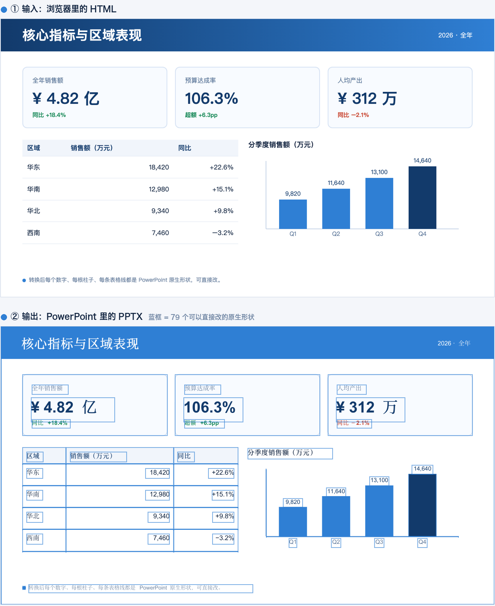
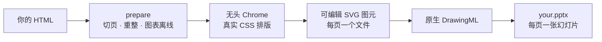

<h1 align="center">html-to-pptx</h1>

<p align="center">
  把 HTML 幻灯片，变成 <strong>真的能改</strong> 的 PowerPoint。<br>
  每个字、每格表、每根柱子都是 PPT 原生形状，不是一张截图。
</p>

<p align="center">
  <a href="https://github.com/yuna78/html-to-pptx/actions/workflows/ci.yml"></a>
  <a href="./LICENSE"></a>
  
  
  
  <a href="./README.en.md"></a>
</p>

<p align="center"></p>

```bash
bin/html-to-pptx report.html      # 产物 report.pptx 就在 report.html 旁边
```

---

## 为什么要有它

「HTML 转 PPT」的常见做法是把每页截成图片贴进幻灯片——**看着像 PPT，改不动**。
客户要你把标题里的一个数字改掉，你只能回去改 HTML 再导一次。

这个工具用无头 Chrome 真实渲染你的页面，读取排版结果，再重建成 **PowerPoint 原生形状**。
上图下半部分的每一个蓝框，都是一个能双击改字、能换颜色、能拖动的普通 PPT 对象。

|  | 截图式导出 | html-to-pptx |
|---|---|---|
| 改一个数字 | 回去改 HTML，重导 | 双击，改 |
| 换品牌色 | 重导 | 选中形状，换填充 |
| 复制其中一张图表 | 只能连页面一起截 | 单独复制到别的 deck |
| 文字能搜索 / 能复制 | ❌ | ✅ |
| 交给不会写代码的同事 | 他改不了 | 他会用 PPT 就行 |

其它几件顺手做掉的事：

- **画布尺寸随你**——1280×720、1600×900、任何自定义尺寸，自动实测，不写死。
- **长报告也能转**——没有分页结构的滚动式报告会按语义块自动切页，超长表格按行拆页并重复表头，**一行都不丢**。
- **渲染时零出网**——浏览器解析不了任何域名，转换过程中页面无法回传数据或外泄本地文件。
- 全程本地跑，不上传、不需要 API key、不依赖任何云服务。

## 快速开始

```bash
git clone https://github.com/yuna78/html-to-pptx.git
cd html-to-pptx
./bin/html-to-pptx examples/showcase-deck.html      # 生成 examples/showcase-deck.pptx
```

第一次运行会自动建好本地 `.venv` 并装两个 Python 包，不需要单独的安装步骤，也不往系统里装东西。

**作为 Claude Code / Claude Desktop 的 skill 用**（clone 到 skills 目录，文件夹名就是 skill 名）：

```bash
git clone https://github.com/yuna78/html-to-pptx.git ~/.claude/skills/html-to-pptx
```

之后直接说「把这个 HTML 报告转成可编辑的 PPT」就会触发。

## 环境依赖

| 依赖 | 干什么用 | 怎么装 |
|---|---|---|
| **Node.js ≥ 22** | 跑 DOM→SVG 提取器（只用内置模块，无需 `npm install`） | `brew install node` · `apt install nodejs` |
| **Google Chrome / Chromium** | 当排版引擎用，无头运行 | [google.com/chrome](https://www.google.com/chrome/) · `apt install chromium-browser` |
| **Python ≥ 3.11** | `python-pptx` + `beautifulsoup4`，首次运行自动装进本地 venv | macOS 自带 · `apt install python3-venv` |
| **中文字体** | 中文正文与图表标签 | macOS 自带 · `apt install fonts-noto-cjk` |

一条命令自检，缺什么会直接给出安装命令：

```bash
bin/html-to-pptx --doctor
```

## 用法

```bash
# 默认：产物与来源 HTML 同目录同名
bin/html-to-pptx path/to/report.html

# 指定输出文件或目录
bin/html-to-pptx path/to/report.html -o path/to/deck.pptx

# 画布尺寸默认自动实测，也可以强制指定
bin/html-to-pptx deck.html --canvas 1600x900

# 变换帮了倒忙时的逃生口
bin/html-to-pptx deck.html --no-prepare
```

| 参数 | 作用 |
|---|---|
| `-o, --output PATH` | 输出 `.pptx` 文件或目录（默认与输入同目录同名） |
| `--canvas auto\|WxH` | 画布尺寸（CSS px）；`auto` 实测首页，默认值 |
| `--no-prepare` | 跳过全部转换前变换，把 HTML 原样交给引擎 |
| `--no-reshape` | 保留 prepare，但不做密排表格 / 富文本重整 |
| `--no-pseudo` | 不物化 `::before` / `::after` 装饰 |
| `--keep-prepared` | 把中间 HTML 留在输入旁边，便于排查 |
| `--chrome PATH` | 指定 Chrome/Chromium 可执行文件 |
| `--doctor` | 只做环境自检 |
| `--quiet` | 少打点日志 |

### 输入 HTML 长什么样最好

**固定画布**：一页一个元素，宽高写死。

```html
<section class="slide" style="width:1280px;height:720px">…第 1 页…</section>
<section class="slide" style="width:1280px;height:720px">…第 2 页…</section>
```

识别的分页类名：`.deck-slide` / `.slide` / `.cover`。都没有，就按滚动式报告自动分页。
CSS、图片、字体尽量内联——渲染时没有网络，远程资源不会被加载。

> 正在新写一套 deck？**别用 `<table>` 排版面**。语义上那不是表格数据，转换器要费很大劲才能保住它。

## 工作原理



关键在中间那步：提取器遍历渲染后的 DOM，为每个可见元素吐一个图元，而不是拍一张图——
这就是产物可编辑的原因。有几种 HTML 形状会在这趟遍历里丢内容（多行表格单元格、
`<div>` 里的 `<b>`、`<br>` 换行、CSS 计数器序号、渐变、伪元素），`prepare.py` 会先把它们改掉。
每种情况对应引擎里的哪条规则，见 [`docs/how-it-works.md`](./docs/how-it-works.md)。

## 已知限制

- **文字按元素整体定位**：一段跨多行折行的正文会被当成一个文本形状放在元素框的位置，
  长段落可能与浏览器里略有出入。幻灯片式的短句不受影响。
- **密排表格重整时不展开 `rowspan`**：会留白，但不会错位。
- **文字与 `<b>` 混排的 `<div>` 里，行内加粗会变成统一字重**——代价是保住这句话不消失，原委见 how-it-works。
- **动画、转场、视频、iframe 不会保留**：幻灯片是静态页。
- **远程资源不会被拉取**：请内联。
- **`<col width>` 定义的列宽不会跟过来**：把宽度写到单元格上。

## 排查

| 现象 | 怎么办 |
|---|---|
| `node: command not found` / 提示没有全局 WebSocket | 装 Node.js ≥ 22 |
| 找不到 Chrome | 装 Chrome/Chromium，或 `--chrome <路径>` |
| `ModuleNotFoundError: pptx` / `bs4` | 用 `bin/html-to-pptx`（会自建 venv），或跑 `bash setup.sh` |
| 只出了 1 页 | 没识别到分页结构，检查上面的分页类名 |
| 一格里的多行并成一段 / `<b>` 里的字不见了 | 重整被 `--no-reshape` 关了，或该表没被判为密排 |
| 列宽走形 | 该 deck 用 `<col width>` 定列宽，改成写在单元格上 |
| 图表变黑 | 图表填色来自渲染时被剥离的 CSS 变量——通常已被补丁覆盖，请提 issue |
| 中文变方框 | 装中文字体 |
| 转换后版式变差 | 依次试 `--no-reshape`、`--no-prepare`，并带上输入提 issue |

## 开发

```bash
bash setup.sh                                   # 建 venv + 依赖自检
.venv/bin/pip install -r requirements-dev.txt   # 加上 pytest
.venv/bin/python -m pytest tests -q             # 单元测试 + 端到端冒烟
```

`tests/test_prepare.py` 是纯 Python，哪儿都能跑；`tests/test_smoke.py` 会真的转 deck，
没有 Node / Chrome 时自动跳过。README 里的插图由 `examples/make-figure.py` 生成，可复现。

| 路径 | 是什么 |
|---|---|
| `convert.py` | 命令行入口：环境自检 → prepare → 调引擎 |
| `prepare.py` | 转换前的 DOM 变换（分页、重整、控件静态化） |
| `engine/` | vendored 的 HTML→SVG→PPTX 引擎（见 `engine/UPSTREAM.md`） |
| `bin/html-to-pptx` | 自举 venv 的一键包装脚本 |
| `vendor/echarts.min.js` | 离线 ECharts，零出网也能出图 |
| `examples/` | 冒烟测试与插图用的示例 deck |

欢迎 PR，约定见 [`CONTRIBUTING.md`](./CONTRIBUTING.md)。

## 致谢与许可

- 转换引擎：[`GX-Alex/html2pptx`](https://github.com/GX-Alex/html2pptx)（MIT），
  vendored fork，本地补丁列在 [`engine/UPSTREAM.md`](./engine/UPSTREAM.md)。
- [Apache ECharts](https://echarts.apache.org/)（Apache-2.0）· [Font Awesome Free](https://fontawesome.com/license/free)（CC BY 4.0）
  · [python-pptx](https://python-pptx.readthedocs.io/)（MIT）· [BeautifulSoup](https://www.crummy.com/software/BeautifulSoup/)（MIT）

本项目基于 [MIT 许可证](./LICENSE) 发布，第三方声明见 [`NOTICE`](./NOTICE)。

> 姊妹项目：[**pdf-to-pptx**](https://github.com/yuna78/pdf-to-pptx) —— 只剩 PDF 的时候用那个。
