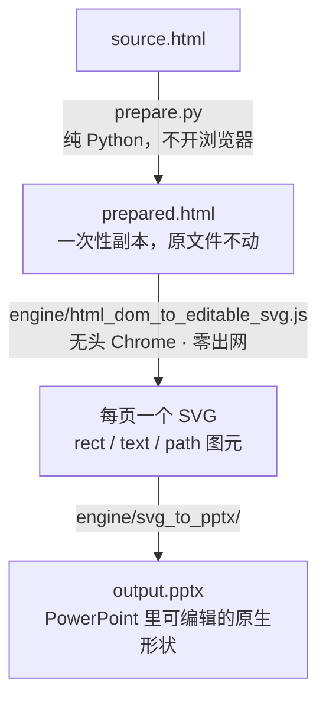

# 工作原理

> English version: [`how-it-works.en.md`](./how-it-works.en.md)

这份文档讲代码里看不出来的部分：为什么需要一层「转换前变换」，以及哪些 HTML 形状
在没有它的时候会**悄悄丢内容**。

## 管线



Chrome **只当排版引擎**用。全程不截图：提取器问 DOM 每个盒子、每条线、每段文字最终落在哪，
然后为它写一个图元。

## 提取器只有一条规则

`engine/html_dom_to_editable_svg.js` 遍历 DOM 时是「命中即返回」：

```js
if (shouldEmitText(el)) { emit(el 的文字); return; }   // 到此为止，不再下钻
for (const child of el.children) walk(child);
```

`shouldEmitText` 对**非 DIV** 的文本标签（`TD`/`TH`/`LI`/`P`/`SPAN`/`B`…）取 `innerText`
——**整棵子树**；对 `DIV` 只取**直接文本节点**。所有「内容被吃掉」的情况，都源于这一处不对称。

### 情况一 · 一格里塞了多行

`<td>` 里有 `<ul>`、`<ol>` 或多个块级子元素时，整格会并成一段文字，行边界全丢。

**修法**：把整个表格家族（`table`/`tr`/`td`…）换成带等价 `display: table-*` 的 `<div>`。
布局分毫不变（含自动列宽），但遍历走的是 DIV 分支，会继续下钻，于是每一行各自出一个文字形状。

两个配套细节让这件事是安全的：

- **CSS 跟着改名走**。`td.wide{width:120px}` 在单元格变成 `<div>` 之后就不匹配了。
  因此凡是选择器里出现表格标签的规则，都复制一份、把 `td` 换成 `[data-was="td"]`，列宽才保得住。
  **不做这步就是「内容对、版式全乱」**——这一步是「能吃别人写的 HTML」的关键。
- **`colspan` 展开**。`display: table` 不认 `colspan`，合并单元格的底色只会铺一列；
  用同 class 的空单元格补齐，底色和边框才连成一片。

**只动密排表**：一格里有列表、有 `<br>`、或有 ≥2 个块级子元素，才算密排。
一格一个值的普通数据表完全不碰，所以这条不可能把简单表格改坏。

### 情况二 · `<div>文字 <b>加粗</b> 还有文字</div>`

DIV 有直接文本 → 遍历吐出这段文字就返回，**`<b>` 里的字整段消失**。

**修法**：把这个元素压成纯文本。代价是这一处的行内加粗变成统一字重；
但对比「整句话不见了」，这是净赚。**只有内联子元素、没有裸文本**的 DIV 不动
——那种引擎会正常下钻，加粗保得住。

### 情况三 · `<br>`

文字清洗会把连续空白压成一个空格，于是 `<br>` 分隔的多行黏成一行。

**修法**：在每个 `<br>` 处拆成块级行 `<div>`。视觉等价（`<br>` 本来就是换行），
每行随后各自出形状。

### 情况四 · 根本不在 DOM 里的东西

有三类装饰只活在 CSS 层，任何 DOM 遍历都看不见。它们由一段注入的脚本在同一个无头 Chrome 里修好
（那里才拿得到 computed style）：

| 装饰 | 修法 |
|---|---|
| CSS `linear-gradient` / `radial-gradient` 背景 | 换成渐变里的一个代表纯色（否则白字深底的标题栏会整块消失） |
| `::before` / `::after` 的圆点、角标、字形 | 物化成真实 `<span>`，复制伪元素的 computed 盒模型，再把伪元素隐藏 |
| CSS 计数器生成的 `<ol>` 序号 | 作为真实文字写进 `<li>` |

物化伪元素时，宿主元素的裸文本也会被包进 span——否则宿主会吐出自己的文字就返回
（又回到情况二），刚注入的装饰永远轮不到被访问。

## 分页

- **幻灯片式输入**（`.deck-slide` / `.slide` / `.cover`）：逐页打标记，一页一张幻灯片。
- **滚动式输入**：顶层块归组成固定画布的页。图表和 section 各占一页，小块（页头、KPI 条）
  累积到首页；超过一页的表格按行拆开，标题与 `<thead>` 每页重复，`<tfoot>` 合计与表后内容
  只留末页。**一行都不会丢**——测试里有断言。

## 画布尺寸

提取前先实测首页尺寸并把 Chrome 调整到同样大小，PPTX 的幻灯片尺寸再跟着生成的 SVG viewBox 走。
声明 1600×900 的 deck 就按 1600×900 导出。`--canvas WxH` 可以在 deck 自身 CSS 有误导时强制覆盖。

早期版本把画布写死成 1280×720，其它尺寸的 deck 直接转不出来。

## 零出网渲染

Chrome 启动时带 `--host-resolver-rules=MAP * ~NOTFOUND`：任何域名都解析不了。
转换过程中，页面无法回传数据、无法探测云元数据、也无法把读到的本地文件发出去。
代价是**远程资源不会被加载**——图片、CSS、字体请内联。
从 CDN 引的 ECharts 会被换成内置 bundle，图表照样画得出来。
